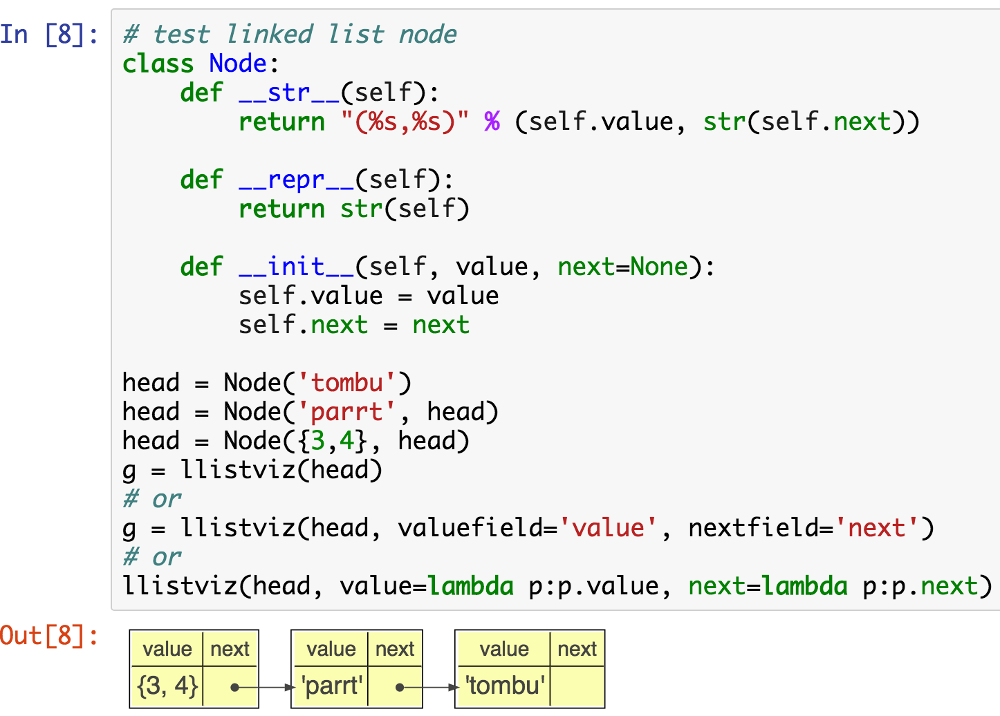
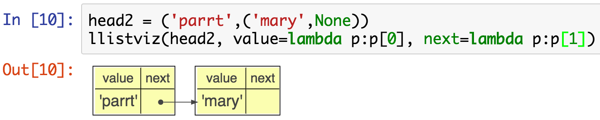
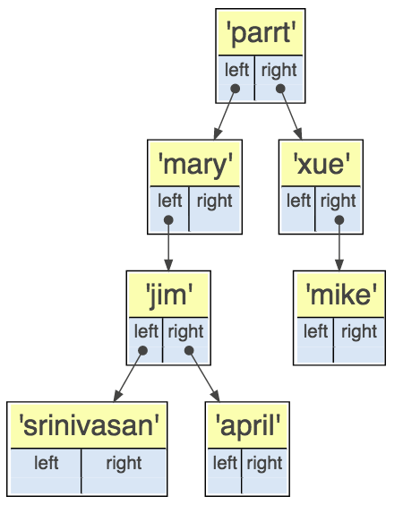

# lolviz

A simple Python data-structure visualization tool for **L**ists **O**f **L**ists, lists, dictionaries, and linked lists; primarily for use in Jupyter notebooks / presentations. It seems that I'm always trying to describe how data is laid out in memory to students. There are really great data structure visualization tools but I wanted something I could use directly via Python in Jupyter notebooks. The look and idea was inspired by the awesome [Python tutor](http://www.pythontutor.com).

There are currently five functions of interest that return `graphviz.files.Source` objects:

* `dictviz()`: A dictionary visualization<br>
* `listviz()`: Horizontal list visualization<br>
* `lolviz()`: List of lists visualization with the first list vertical and the nested lists horizontal.<br>
* `llistviz()`: Linked list visualization with horizontal orientation<br>
* `treeviz()`: Binary trees showing top-down<br>

## Installation

First you need graphviz. On a mac it's easy:

```bash
$ brew install graphviz
```

```bash
$ pip install lolviz
```

## Usage

From within generic Python, you can get a window to pop up using the `render()` method:

```python
from lolviz import *
g = listviz(['hi','mom',{3,4},{"parrt":"user"}])
g.render(view=True) # render graphviz.files.Source object
```


From within Jupyter notebooks you can avoid the `render()` call because Jupyter knows how to display `graphviz.files.Source` objects:


You can look at a list of tuples as a list of list too:


Here's how to describe a hashtable with 3 elements in 2 different buckets:


If you want the graphviz/dot source, use `source` field of returned `graphviz.files.Source` object.

For 1.1, I added linked lists. Figuring out that layout was annoying. You're welcome. ;)



Here's an example of specifying lambda functions to extract values from nodes:



Here's an example for binary trees:

```python
class Tree:
    def __init__(self, value, left=None, right=None):
        self.value = value
        self.left = left
        self.right = right

root = Tree('parrt',
            Tree('mary',
                 Tree('jim',
                      Tree('srinivasan'),
                      Tree('april'))),
            Tree('xue',None,Tree('mike')))
treeviz(root)
```



And another:

```python
root = ('parrt',('mary',('srinivasan',None,None),('april',None,None)),None)
treeviz(root, value=lambda t:t[0], left=lambda t:t[1], right=lambda t:t[2])
```


## Implementation notes

### graphviz

* Ugh. `shape=record` means html-labels can't use ports. warning!

* warning: `<td>` and `</td>` must be on same line or row is super wide!
    
### deploy

```bash
$ python setup.py sdist upload 
```

Or to install locally

```bash
$ cd ~/github/lolviz
$ pip install .
```
