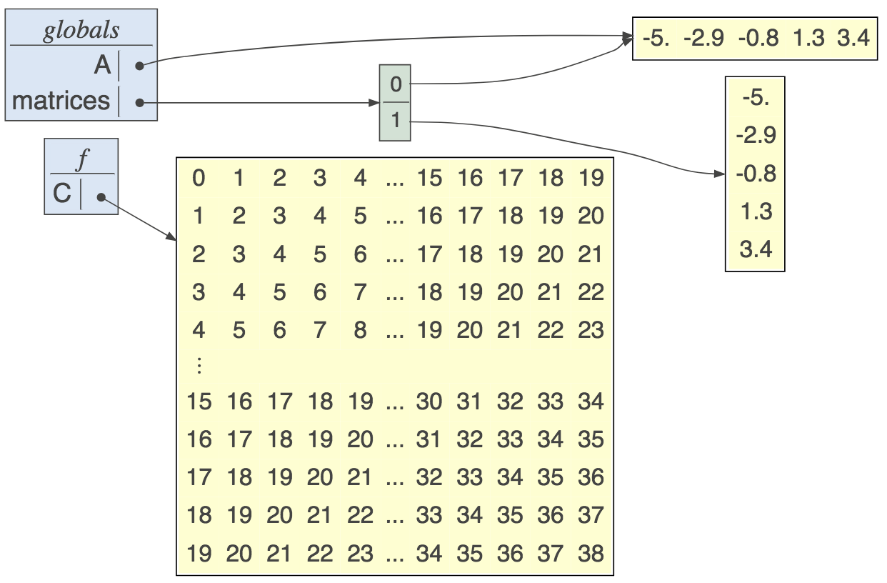
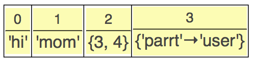
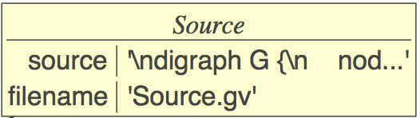
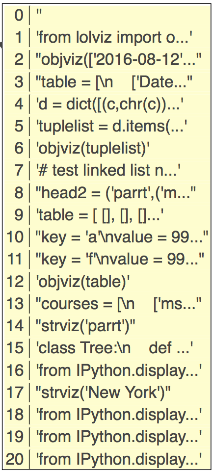

# lolviz

By <a href="http://explained.ai/">Terence Parr</a>. See [Explained.ai](http://explained.ai) for more stuff.

A very nice looking [javascript lolviz port with improvements](https://github.com/websemantics/lolviz.js) by [Adnan M.Sagar](https://github.com/websemantics).

A simple Python data-structure visualization tool that started out as a **L**ist **O**f **L**ists (lol) visualizer but now handles arbitrary object graphs, including function call stacks! lolviz tries to look out for and format nicely common data structures such as lists, dictionaries, linked lists, and binary trees. This package is primarily for use in teaching and presentations with Jupyter notebooks, but could also be used for debugging data structures. Useful for devoting machine learning data structures, such as decision trees, as well.

It seems that I'm always trying to describe how data is laid out in memory to students. There are really great data structure visualization tools but I wanted something I could use directly via Python in Jupyter notebooks. 

The look and idea was inspired by the awesome [Python tutor](http://www.pythontutor.com). The graphviz/dot tool does all of the heavy lifting underneath for layout; my contribution is primarily making graphviz display objects in a nice way.

## Functionality

There are currently a number of functions of interest that return `graphviz.files.Source` objects:

* `listviz()`: Horizontal list visualization<br>
* `lolviz()`: List of lists visualization with the first list vertical and the nested lists horizontal.<br>
* `treeviz()`: Binary trees visualized top-down ala computer science.<br>
* `objviz()`: Generic object graph visualization that knows how to find lists of lists (like `lolviz()`) and linked lists. Trees are also displayed reasonably, but with left to right orientation instead of top-down (a limitation of graphviz). Here is an example linked list and dictionary:<br><br>
* `callsviz()`: Visualize the call stack and anything pointed to by globals, locals, or parameters. You can limit the variables displayed by passing in a list of `varnames` as an argument.<br>
* `callviz()`: Same as `callsviz()` but displays only the current function's frame or you can pass in a Python stack frame object to display.
* `matrixviz(data)`: Display numpy `ndarray`; only 1D and 2D at moment.<br>
* `strviz()`: Show a string like an array.<br>

Given the return value in generic Python, simply call method `view()` on the returned object to display the visualization. From jupyter, call function `IPython.display.display()` with the returned object as an argument. Function arguments are in italics.

Check out the [examples](examples.ipynb).

## Installation

First you need graphviz (more specifically the `dot` executable). On a mac it's easy:

```bash
$ brew install graphviz
```

Then just install the `lolviz` Python package:

```bash
$ pip install lolviz
```

or upgrade to the latest version:


```bash
$ pip install -U lolviz
```

## Usage

From within generic Python, you can get a window to pop up using the `view()` method:

```python
from lolviz import *
data = ['hi','mom',{3,4},{"parrt":"user"}]
g = listviz(data)
print(g.source) # if you want to see the graphviz source
g.view() # render and show graphviz.files.Source object
```



From within Jupyter notebooks you can avoid the `render()` call because Jupyter knows how to display `graphviz.files.Source` objects:


For more examples that you can cut-and-paste, please see the jupyter notebook full of [examples](examples.ipynb).

## Preferences

There are global preferences you can set that affect the display for long values:

* `prefs.max_str_len` (Default 20). How many chars in a string representation of a value before we abbreviate with `...`. E.g.,:<br>
* `prefs.max_horiz_array_len` (Default 70) Lists can quickly become too wide and distort the visualization. This preference lets you set how long the combined string representations of the list values can get before we use a vertical representation of the list. E.g.,:<br>
* `prefs.max_list_elems`. Horizontal and vertical lists and sets show maximum of 10 (default) elements.
* `prefs.float_precision`. How many decimal places to show for floats (default is 5).

## Implementation notes

Mostly notes for parrt to remember things.
### Graphviz

* Ugh. `shape=record` means html-labels can't use ports. warning!

* warning: `<td>` and `</td>` must be on same line or row is super wide!
    
### Deploy

```bash
$ python setup.py sdist upload 
```

Or to install locally

```bash
$ cd ~/github/lolviz
$ pip install .
```
